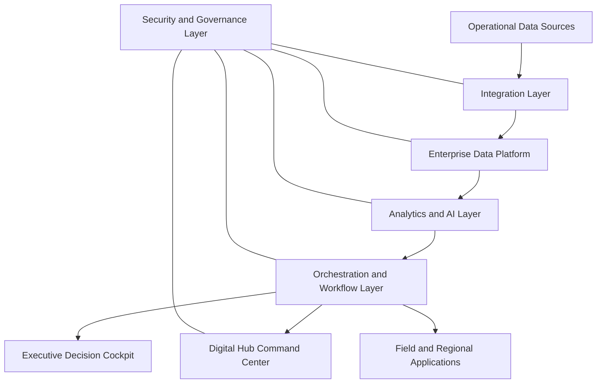
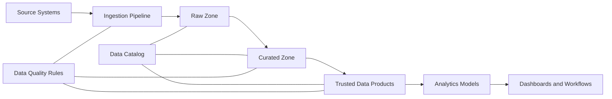

# Pertamina Digital Hub: Solution Concept, Solution Architecture, and Target Outcomes

## 1. Purpose

Dokumen ini menjelaskan konsep solusi digitalisasi untuk Pertamina Digital Hub, mencakup:

1. Solution concept
2. Solution architecture
3. Capability map
4. Data and integration architecture
5. Security and governance architecture
6. Target outcomes and KPI alignment
7. Implementation roadmap

Solusi ini dirancang untuk mendukung kebutuhan Pertamina dalam meningkatkan visibility operasional, mempercepat pengambilan keputusan, memperkuat pengawasan distribusi energi, meningkatkan efisiensi rantai pasok, serta mendukung pengelolaan risiko operasional dan digital secara lebih terstruktur.

---

## 2. Strategic Context

Pertamina Digital Hub berperan sebagai pusat integrasi data, monitoring, analitik, dan orkestrasi operasional lintas rantai nilai energi. Lingkupnya mencakup hulu, pengolahan, pengapalan, terminal, distribusi, retail, LPG, Avtur, BBM subsidi, aset operasional, HSSE, ESG, dan keamanan digital.

Kebutuhan utama yang perlu dijawab adalah:

| Area                    | Kebutuhan                                                                         |
| ----------------------- | --------------------------------------------------------------------------------- |
| Energy Availability     | Monitoring pasokan, stok, demand, dan potensi kelangkaan secara near real time.   |
| Distribution Efficiency | Optimasi distribusi BBM, LPG, Avtur, dan produk energi lain lintas wilayah.       |
| Subsidy Governance      | Pengawasan transaksi subsidi agar lebih akuntabel dan berbasis data.              |
| Decision Velocity       | Percepatan eskalasi, koordinasi, dan tindakan berbasis alert serta analitik.      |
| Asset Reliability       | Pengawasan kondisi aset kritikal dan penurunan risiko downtime.                   |
| HSSE                    | Peningkatan pengawasan keselamatan, kepatuhan operasional, dan respons insiden.   |
| ESG and NZE             | Pengelolaan data emisi, carbon tracking, biodiversity, dan program keberlanjutan. |
| Cyber Resilience        | Perlindungan sistem IT, OT, IoT, data platform, dan command center.               |

---

## 3. Solution Concept

### 3.1 Concept Overview

Solusi yang diusulkan adalah **Integrated Energy Digital Hub**, yaitu platform enterprise yang menghubungkan data operasional, analitik, command center, workflow, dan executive decision support dalam satu ekosistem digital.

Solusi ini tidak hanya menampilkan data, tetapi juga membantu organisasi:

1. Melihat kondisi operasional lintas subholding dan wilayah.
2. Mendeteksi anomali, risiko, dan deviasi lebih cepat.
3. Mengubah alert menjadi action workflow yang terukur.
4. Memberikan rekomendasi berbasis analitik untuk pengambilan keputusan.
5. Menyediakan audit trail untuk pengawasan, kepatuhan, dan pelaporan.
6. Menghubungkan KPI operasional dengan outcome bisnis.

---

## 4. Solution Objectives

| Objective                | Description                                                                                         |
| ------------------------ | --------------------------------------------------------------------------------------------------- |
| Integrated Visibility    | Menyatukan data lintas hulu, kilang, shipping, terminal, distribusi, retail, dan ESG.               |
| Faster Decision Making   | Menyediakan insight, alert, dan rekomendasi untuk mempercepat respons manajemen.                    |
| Operational Efficiency   | Mengurangi gap antara perencanaan, distribusi, stok, dan realisasi operasional.                     |
| Subsidy Accuracy         | Meningkatkan pengawasan transaksi BBM subsidi melalui analitik anomali.                             |
| Asset Reliability        | Mengoptimalkan monitoring aset kritikal melalui sensor, inspeksi digital, dan predictive analytics. |
| Risk Management          | Menghubungkan risiko operasional, distribusi, geopolitik, HSSE, dan cyber dalam satu view.          |
| ESG Accountability       | Mengelola data ESG, emisi, carbon, biodiversity, dan program keberlanjutan secara lebih rapi.       |
| Secure Digital Operation | Memastikan sistem digital berjalan dengan kontrol keamanan yang memadai.                            |

---

## 5. Target Capabilities

### 5.1 Capability Map

| Capability                  | Description                                                                                           | Main Users                                  |
| --------------------------- | ----------------------------------------------------------------------------------------------------- | ------------------------------------------- |
| Energy Control Tower        | Monitoring stok, demand, distribusi, supply risk, dan availability lintas wilayah.                    | Executive, supply chain, regional operation |
| Subsidy Integrity Analytics | Analitik transaksi BBM subsidi untuk mendeteksi pola tidak wajar.                                     | Retail, compliance, regulator liaison       |
| Demand Forecasting          | Prediksi kebutuhan BBM, LPG, Avtur, dan produk energi berdasarkan data historis dan faktor eksternal. | Supply chain, regional planning             |
| Logistics Optimization      | Optimasi rute, alokasi, replenishment, dan utilisasi armada.                                          | Distribution, terminal, shipping            |
| Maritime Risk Monitoring    | Monitoring kapal, rute, ETA, port condition, cuaca, dan risiko geopolitik.                            | Shipping, crisis center                     |
| Asset Reliability Analytics | Monitoring kondisi aset, prediksi gangguan, dan inspeksi berbasis AI.                                 | Maintenance, asset owner, HSSE              |
| HSSE Monitoring             | Monitoring insiden, kepatuhan, safety observation, dan closure action.                                | HSSE, operation                             |
| ESG and Carbon Data Hub     | Pengelolaan data emisi, energi, carbon, biodiversity, dan program ESG.                                | ESG, sustainability, corporate planning     |
| Cyber Resilience Monitoring | Monitoring keamanan IT, OT, cloud, endpoint, API, dan data platform.                                  | SOC, CISO office, OT security               |
| Orchestration Workflow      | Case management untuk alert, eskalasi, tindakan, bukti, dan closure.                                  | Operation center, regional, management      |

---

## 6. Solution Architecture

### 6.1 High-Level Architecture

---

## 7. Architecture Layers

### 7.1 Operational Data Sources

Layer ini menghubungkan seluruh sumber data yang relevan untuk operasional energi.

| Source Category    | Example Data                                                                      |
| ------------------ | --------------------------------------------------------------------------------- |
| Upstream           | Produksi, lifting, well performance, offshore operation, asset condition.         |
| Refinery           | Throughput, yield, stock, maintenance, downtime, reliability.                     |
| Shipping           | Vessel position, ETA, cargo, route, weather, port status.                         |
| Terminal and Depot | Stock, loading, unloading, tank level, dispatch, queue.                           |
| Retail and SPBU    | Sales transaction, nozzle, dispenser, POS, CCTV, stock, payment.                  |
| LPG Distribution   | Agen, pangkalan, volume distribusi, allocation, transaction history.              |
| Aviation Fuel      | Depot Avtur, airport demand, stock, delivery status.                              |
| MyPertamina        | Customer transaction, QR usage, loyalty, payment, digital channel activity.       |
| HSSE               | Incident, observation, permit, inspection, corrective action.                     |
| ESG                | Emission, energy consumption, carbon, biodiversity, TJSL program.                 |
| External Data      | Weather, disaster, traffic, port congestion, geopolitical risk, media monitoring. |
| Cybersecurity      | SIEM, SOC, OT monitoring, vulnerability, endpoint, network telemetry.             |

---

### 7.2 Integration Layer

Integration layer bertugas menghubungkan data dari sistem sumber ke platform enterprise.

| Component              | Function                                                                       |
| ---------------------- | ------------------------------------------------------------------------------ |
| API Gateway            | Mengelola pertukaran data antar aplikasi melalui API yang aman.                |
| Event Streaming        | Mengalirkan data operasional real time atau near real time.                    |
| ETL/ELT Pipeline       | Mengambil, membersihkan, dan memuat data batch ke data platform.               |
| IoT and OT Connector   | Menghubungkan sensor, SCADA, PLC, CCTV, dan perangkat operasional.             |
| Data Validation Engine | Memeriksa kelengkapan, format, duplikasi, dan anomali data.                    |
| Master Data Management | Menyelaraskan data referensi seperti lokasi, produk, aset, wilayah, dan mitra. |

---

### 7.3 Enterprise Data Platform

Layer ini menjadi pusat pengelolaan data enterprise untuk kebutuhan reporting, analitik, AI, dan audit.

| Component               | Function                                                                |
| ----------------------- | ----------------------------------------------------------------------- |
| Data Lakehouse          | Menyimpan data structured, semi-structured, dan unstructured.           |
| Operational Data Store  | Menyediakan data operasional dengan latensi rendah.                     |
| Time-Series Database    | Menyimpan data sensor, SCADA, IoT, dan telemetry.                       |
| Geospatial Database     | Mendukung peta distribusi, rute, wilayah, aset, dan risiko lokasi.      |
| Data Catalog            | Mendokumentasikan dataset, owner, lineage, quality, dan classification. |
| Data Quality Management | Mengukur akurasi, kelengkapan, konsistensi, dan freshness data.         |
| Audit Trail Repository  | Menyimpan riwayat akses, perubahan data, alert, action, dan keputusan.  |

---

### 7.4 Analytics and AI Layer

Layer ini menyediakan analitik deskriptif, diagnostik, prediktif, dan preskriptif.

| Analytics Domain              | Use Case                                                                             |
| ----------------------------- | ------------------------------------------------------------------------------------ |
| Supply and Demand Forecasting | Prediksi kebutuhan BBM, LPG, Avtur, dan produk energi per wilayah.                   |
| Subsidy Anomaly Detection     | Deteksi transaksi tidak wajar, duplikasi pola pembelian, dan potensi penyalahgunaan. |
| Inventory Risk Analytics      | Deteksi stok kritis, coverage days rendah, dan potensi keterlambatan suplai.         |
| Route Optimization            | Rekomendasi distribusi berdasarkan demand, jarak, stok, kapasitas, dan risiko.       |
| Maritime Risk Analytics       | Risiko rute kapal, delay, port congestion, cuaca, dan geopolitik.                    |
| Predictive Maintenance        | Prediksi potensi gangguan aset berdasarkan sensor dan histori maintenance.           |
| Computer Vision               | Analisis CCTV, inspeksi aset, PPE compliance, dan kondisi lapangan.                  |
| ESG Analytics                 | Carbon tracking, emission intensity, biodiversity monitoring, dan program impact.    |
| Media and Sentiment Analytics | Monitoring isu publik, media, dan eskalasi reputasi.                                 |
| Cyber Threat Analytics        | Korelasi alert, deteksi anomali, dan prioritas respons insiden.                      |

---

### 7.5 Orchestration and Workflow Layer

Layer ini mengubah insight dan alert menjadi tindakan yang dapat dilacak.

| Workflow Component   | Function                                                                                   |
| -------------------- | ------------------------------------------------------------------------------------------ |
| Alert Management     | Mengelola alert berdasarkan severity, wilayah, aset, produk, dan risiko.                   |
| Case Management      | Membuat case untuk investigasi, tindak lanjut, dan penyelesaian.                           |
| Escalation Engine    | Mengatur eskalasi berdasarkan SLA, tingkat risiko, dan otoritas keputusan.                 |
| Approval Workflow    | Mendukung persetujuan tindakan seperti reallocation, replenishment, dan corrective action. |
| Evidence Management  | Menyimpan bukti tindakan, screenshot, log, dokumen, dan catatan investigasi.               |
| SLA Tracker          | Memantau waktu respons, waktu penyelesaian, dan backlog.                                   |
| Post-Incident Review | Mendokumentasikan akar masalah, tindakan korektif, dan lesson learned.                     |

---

### 7.6 Presentation and Command Layer

Layer ini menjadi interface utama bagi executive, operation center, regional team, dan field team.

| Interface                        | Description                                                                                |
| -------------------------------- | ------------------------------------------------------------------------------------------ |
| Executive Decision Cockpit       | Tampilan KPI strategis, risk heatmap, critical alert, dan rekomendasi keputusan.           |
| Energy Control Tower             | Monitoring pasokan, stok, distribusi, terminal, SPBU, LPG, Avtur, dan wilayah kritis.      |
| Regional Operation Dashboard     | Monitoring operasional per regional, depot, terminal, SPBU, dan distribusi.                |
| Field Mobile Application         | Aplikasi untuk tindak lanjut alert, inspeksi lapangan, update status, dan evidence upload. |
| Crisis Room View                 | Tampilan khusus untuk kondisi bencana, Nataru, Lebaran, geopolitik, dan supply disruption. |
| ESG and Sustainability Dashboard | Monitoring emisi, carbon, biodiversity, TJSL, dan indikator keberlanjutan.                 |
| Cyber and OT Security Dashboard  | Monitoring alert cyber, vulnerability, incident, dan status kontrol keamanan.              |

---

### 7.7 Security and Governance Layer

Security dan governance diterapkan pada seluruh layer arsitektur.

| Domain                         | Control                                                                                |
| ------------------------------ | -------------------------------------------------------------------------------------- |
| Identity and Access Management | Role-based access control, privileged access management, MFA, dan user lifecycle.      |
| Data Protection                | Encryption, tokenization, masking, backup, dan retention policy.                       |
| API Security                   | Authentication, authorization, rate limiting, schema validation, dan logging.          |
| OT Security                    | Network segmentation, passive monitoring, asset discovery, dan secure remote access.   |
| SOC Integration                | SIEM, SOAR, incident response, threat intelligence, dan security dashboard.            |
| Model Governance               | Model inventory, model monitoring, bias check, drift detection, dan approval workflow. |
| Data Governance                | Data owner, data steward, data catalog, data quality score, dan lineage.               |
| Compliance                     | Audit trail, regulatory reporting, retention, access review, dan evidence management.  |

---

## 8. Data Architecture

### 8.1 Data Product Examples

| Data Product                | Description                                                                                | Primary Consumer             |
| --------------------------- | ------------------------------------------------------------------------------------------ | ---------------------------- |
| National Stock Position     | Posisi stok nasional per produk, wilayah, terminal, depot, dan outlet.                     | Supply chain, executive      |
| Subsidy Transaction Profile | Profil transaksi subsidi berdasarkan waktu, lokasi, produk, kendaraan, dan pola pembelian. | Retail, compliance           |
| Regional Demand Forecast    | Prediksi demand per wilayah, produk, dan periode.                                          | Planning, regional operation |
| Critical Asset Health       | Status aset kritikal berdasarkan sensor, inspeksi, dan histori maintenance.                | Asset owner, maintenance     |
| Vessel Movement and Risk    | Pergerakan kapal, ETA, cargo, route risk, dan port condition.                              | Shipping, crisis center      |
| ESG Performance Dataset     | Data emisi, energi, carbon, biodiversity, dan program ESG.                                 | ESG, sustainability          |
| Cyber Risk Posture          | Status risiko keamanan digital, vulnerability, incident, dan kontrol.                      | SOC, CISO office             |

---

## 9. Target Outcomes

### 9.1 Business and Operational Outcomes

| Outcome                        | Description                                                                | KPI Example                                                                  |
| ------------------------------ | -------------------------------------------------------------------------- | ---------------------------------------------------------------------------- |
| Improved Energy Availability   | Peningkatan kemampuan memantau pasokan dan stok lintas wilayah.            | Stockout rate, coverage days, critical stock count.                          |
| Faster Operational Response    | Percepatan respons terhadap alert stok, distribusi, aset, HSSE, dan cyber. | Alert-to-action time, SLA compliance, case closure time.                     |
| Better Subsidy Governance      | Peningkatan pengawasan transaksi BBM subsidi berbasis data.                | Anomaly detection rate, case closure SLA, suspected leakage value.           |
| Higher Distribution Efficiency | Optimasi alokasi, rute, dan replenishment.                                 | ETA accuracy, cost per KL, fleet utilization, emergency replenishment count. |
| Improved Asset Reliability     | Peningkatan visibility terhadap kondisi aset dan potensi gangguan.         | Unplanned downtime, predictive maintenance accuracy, inspection closure SLA. |
| Stronger HSSE Monitoring       | Peningkatan pemantauan kepatuhan dan tindak lanjut insiden.                | Incident rate, corrective action closure, inspection completion rate.        |
| Better ESG Data Management     | Penyusunan data ESG, emisi, carbon, dan biodiversity yang lebih konsisten. | ESG data completeness, emission intensity, carbon inventory coverage.        |
| Improved Cyber Resilience      | Peningkatan visibility dan respons terhadap risiko cyber IT dan OT.        | MTTD, MTTR, vulnerability closure SLA, OT asset visibility.                  |

---

## 10. KPI Alignment

| Strategic KPI             | Digital Capability                                             | Measurement Approach                                          |
| ------------------------- | -------------------------------------------------------------- | ------------------------------------------------------------- |
| Energy Supply Reliability | Energy Control Tower, Forecasting, Inventory Risk Analytics    | Coverage days, stock availability, critical alert resolution. |
| Distribution Efficiency   | Logistics Optimization, Demand Forecasting, Regional Dashboard | Route efficiency, delivery punctuality, fleet utilization.    |
| Subsidy Accuracy          | Subsidy Integrity Analytics, Case Management                   | Anomaly rate, valid transaction rate, investigation closure.  |
| Decision Speed            | Executive Cockpit, Alert Management, Escalation Workflow       | Time from alert to decision, time from decision to action.    |
| Asset Reliability         | Digital Twin, Predictive Maintenance, AI Inspection            | Downtime, inspection cycle time, anomaly resolution.          |
| HSSE Performance          | HSSE Monitoring, Field Mobile App, Corrective Action Tracker   | Incident rate, action closure, compliance score.              |
| ESG and NZE Progress      | ESG Data Hub, Carbon Analytics, Sustainability Dashboard       | Emission intensity, carbon tracking coverage, program impact. |
| Cyber Resilience          | SOC Integration, OT Monitoring, Vulnerability Management       | MTTD, MTTR, patch closure, incident containment.              |

---

## 11. Implementation Roadmap

### Phase 1: 0 to 90 Days

| Workstream              | Deliverable                                                          |
| ----------------------- | -------------------------------------------------------------------- |
| KPI and Data Baseline   | KPI dictionary, data source inventory, data owner mapping.           |
| Control Tower MVP       | Stock dashboard, regional supply map, critical stock alert.          |
| Subsidy Analytics Pilot | Rule-based anomaly detection for selected regions and products.      |
| Workflow MVP            | Alert triage, owner assignment, SLA tracking, evidence upload.       |
| Cyber Baseline          | IT and OT asset inventory, vulnerability baseline, monitoring scope. |

---

### Phase 2: 3 to 6 Months

| Workstream              | Deliverable                                                                   |
| ----------------------- | ----------------------------------------------------------------------------- |
| Data Platform Expansion | Lakehouse, streaming pipeline, data catalog, data quality dashboard.          |
| Demand Forecasting      | Regional demand forecast for BBM, LPG, and Avtur.                             |
| Logistics Optimization  | Replenishment recommendation, route visibility, fleet utilization dashboard.  |
| Subsidy Case Management | Investigation workflow, escalation, evidence repository, closure tracking.    |
| Regional Dashboard      | Regional operation view for supply, distribution, outlet, and issue tracking. |

---

### Phase 3: 6 to 12 Months

| Workstream                  | Deliverable                                                                     |
| --------------------------- | ------------------------------------------------------------------------------- |
| Asset Reliability Analytics | Predictive maintenance model, inspection dashboard, asset health scoring.       |
| Maritime Risk Monitoring    | Vessel tracking, route risk, ETA prediction, crisis view.                       |
| ESG Data Hub                | Carbon tracking, emission dashboard, biodiversity monitoring, ESG data catalog. |
| OT Security Monitoring      | Passive OT monitoring, segmentation review, incident playbook.                  |
| Executive Decision Cockpit  | Strategic KPI view, risk heatmap, alert summary, recommendation panel.          |

---

### Phase 4: 12 to 18 Months

| Workstream                 | Deliverable                                                                    |
| -------------------------- | ------------------------------------------------------------------------------ |
| Enterprise Orchestration   | Cross-subholding workflow, escalation automation, integrated situation room.   |
| Advanced AI and Simulation | Scenario planning, demand shock simulation, supply disruption simulation.      |
| Model Governance           | Model inventory, model performance monitoring, drift detection, approval flow. |
| Continuous Improvement     | KPI review, adoption tracking, operating model refinement.                     |

---

## 12. Operating Model

| Role                   | Responsibility                                                                   |
| ---------------------- | -------------------------------------------------------------------------------- |
| Digital Hub Owner      | Menentukan prioritas, KPI, roadmap, dan koordinasi lintas fungsi.                |
| Business Product Owner | Mengelola backlog use case dan memastikan solusi menjawab kebutuhan bisnis.      |
| Data Owner             | Bertanggung jawab atas definisi, kualitas, akses, dan penggunaan data.           |
| Data Steward           | Mengelola metadata, data quality rules, dan data catalog.                        |
| Platform Team          | Mengelola data platform, integration layer, API, dan observability.              |
| Analytics Team         | Mengembangkan model forecasting, anomaly detection, optimization, dan AI.        |
| Operation Center Team  | Memantau alert, melakukan triage, eskalasi, dan koordinasi tindakan.             |
| Cybersecurity Team     | Mengelola kontrol keamanan, monitoring, incident response, dan risk posture.     |
| Regional Team          | Menindaklanjuti alert, update status, dan menyelesaikan action item di lapangan. |
| Governance Board       | Mengawasi prioritas, risiko, benefit tracking, dan kepatuhan.                    |

---

## 13. Governance Principles

| Principle            | Description                                                                       |
| -------------------- | --------------------------------------------------------------------------------- |
| Business KPI Driven  | Setiap use case harus terhubung dengan KPI dan outcome yang jelas.                |
| Data Ownership       | Setiap data product harus memiliki owner dan steward.                             |
| Actionable Insight   | Dashboard harus memiliki mekanisme tindak lanjut, bukan hanya visualisasi.        |
| Auditability         | Setiap alert, keputusan, tindakan, dan perubahan data harus memiliki jejak audit. |
| Security by Design   | Keamanan diterapkan sejak desain integrasi, data, aplikasi, dan operasi.          |
| Incremental Delivery | Implementasi dilakukan bertahap dengan prioritas pada use case bernilai tinggi.   |
| Measurable Adoption  | Penggunaan sistem diukur melalui adoption rate, SLA, dan outcome tracking.        |

---

## 14. Success Metrics

| Category                | Metric                                                                            |
| ----------------------- | --------------------------------------------------------------------------------- |
| Platform Adoption       | Active user, dashboard usage, workflow completion rate.                           |
| Data Quality            | Completeness, accuracy, freshness, duplicate rate, data quality score.            |
| Operational Response    | Alert-to-action time, case closure time, SLA compliance.                          |
| Supply Reliability      | Coverage days, stockout incident, critical stock duration.                        |
| Distribution Efficiency | ETA accuracy, route efficiency, fleet utilization, emergency replenishment count. |
| Subsidy Governance      | Anomaly detection rate, investigation closure, valid transaction rate.            |
| Asset Reliability       | Downtime, inspection cycle time, maintenance action closure.                      |
| ESG Management          | ESG data completeness, carbon inventory coverage, emission intensity tracking.    |
| Cyber Resilience        | MTTD, MTTR, vulnerability closure, OT asset visibility.                           |

---

## 15. Expected Benefits

| Benefit Area   | Expected Benefit                                                                            |
| -------------- | ------------------------------------------------------------------------------------------- |
| Management     | Keputusan lebih cepat karena data, alert, dan rekomendasi tersedia dalam satu sistem.       |
| Operation      | Tim operasional memiliki visibility lebih baik terhadap stok, distribusi, aset, dan risiko. |
| Regional       | Regional team dapat menindaklanjuti alert dengan SLA dan evidence yang jelas.               |
| Compliance     | Pengawasan subsidi, audit trail, dan pelaporan menjadi lebih terstruktur.                   |
| Sustainability | Data ESG, carbon, dan biodiversity dapat dikelola dengan standardisasi yang lebih baik.     |
| Security       | Risiko digital pada IT, OT, dan data platform dapat dipantau secara lebih konsisten.        |
| Public Service | Potensi gangguan pasokan dan distribusi dapat dideteksi lebih awal.                         |

---

## 16. Summary

Pertamina Digital Hub perlu dikembangkan sebagai platform enterprise yang menyatukan data, analitik, command center, workflow, dan governance untuk mendukung operasi energi nasional.

Solusi yang diusulkan mencakup:

1. Energy Control Tower
2. Subsidy Integrity Analytics
3. Supply and Demand Forecasting
4. Logistics and Maritime Risk Monitoring
5. Asset Reliability Analytics
6. HSSE Monitoring
7. ESG and Carbon Data Hub
8. Cyber Resilience Monitoring
9. Orchestration and Workflow Engine
10. Executive Decision Cockpit

Dengan pendekatan ini, Digital Hub dapat membantu Pertamina meningkatkan visibility operasional, mempercepat respons, memperkuat pengawasan subsidi, meningkatkan efisiensi distribusi, memperbaiki pengelolaan aset, dan mendukung agenda ESG serta keamanan digital secara lebih terukur.
